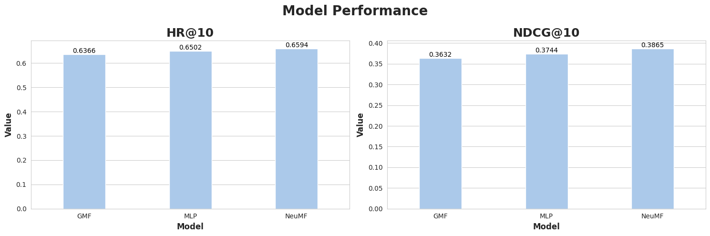
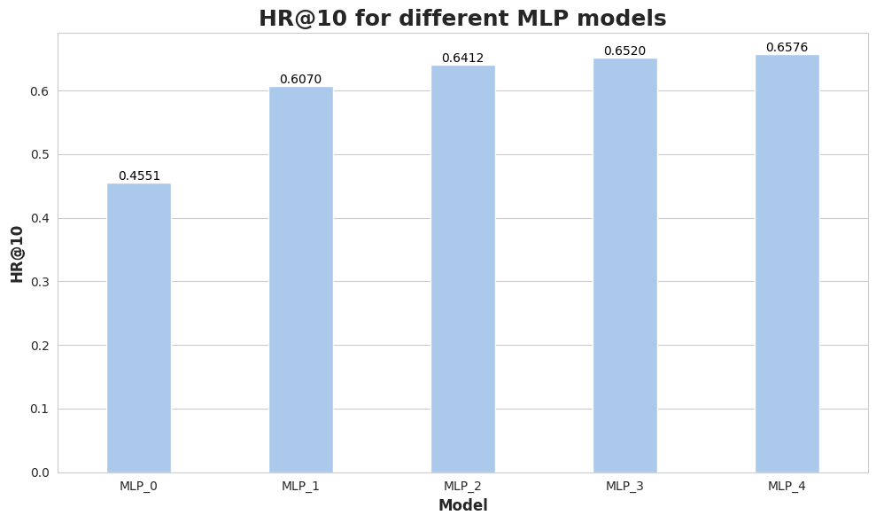

# STA326 Assignment3 Practice of Recommender System

SID: 12110613  
Name: Ren Jiaxi

----
## Task 1: Verify the Pytorch Version
First using `print(torch.__version__)` to check the version of Pytorch: 2.3.0a0+6ddf5cf85e.nv24.04. It's the latest.

## Task 2: Implement the Three Methods
- First, I define a class named "NCF" to init all the layers which these three methods need, then define three classes inheriting from "NCF" to implement the three methods. The three methods just differ from their `forward` function.
- Second, the three methods share the same inputs (user index and item index) and outputs (probability of the user-item pair). So they can share the same training and testing procedure.

## Take 3: Training and Testing Setting
The loss function I choose is `BCELoss()` and in the training procedure, the number of negative instances per positive instance is set to 4. For the three models, initializing the embedding layers with random Gaussian distribution and the linear layers with uniform distribution. The batch size is set to 256 and the learning rate of `Adam` is set to 0.001. The number of the predicted factor is set to 8. The epoch number is set to 100.

## Task 4: Comparison of the Three Methods with HR@10 and NDCG@10

From the result we can see that the performance of the three methods is: NeuMF > MLP > GMF on HR@10 and NDCG@10.

## Task 5: Reproduce the Result in Table 3
For the task, I reproduce the result of MLP-0, MLP-1, MLP-2, MLP-3, MLP-4 on MovieLens dataset with factors 8 using HR@10 as metric:

It shows that the performance of the model is getting better with the increase of the number of layers.