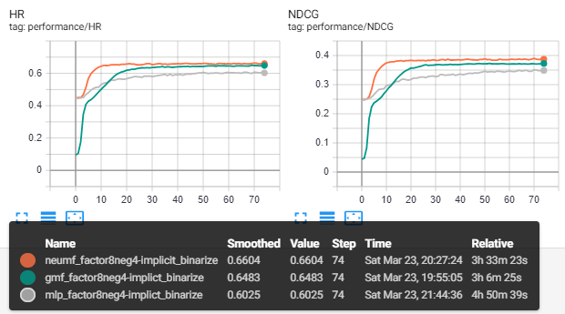

# neural-collaborative-filtering

## Files

> `data.py`: prepare train/test dataset
>
> `utils.py`: some handy functions for model training etc.
>
> `metrics.py`: evaluation metrics including hit ratio(HR) and NDCG
>
> `gmf.py`: generalized matrix factorization model
>
> `mlp.py`: multi-layer perceptron model
>
> `neumf.py`: fusion of gmf and mlp
>
> `engine.py`: training engine
>
> `train.py`: entry point for train a NCF model

 
It can be observed that NeuMF performs better than MLP and GMF.
### Pytorch Versions
The repo works under torch 1.0. You can find the old versions working under torch 0.2 and 0.4 in **tags**.

### TODO
- Batchify the test data to handle large dataset.
