# STA323 Assignment3

## 12111641 魏悦阳

### Requirements

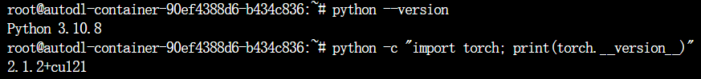

### Model description

| Model                                                        | Summary                                                      |
| ------------------------------------------------------------ | ------------------------------------------------------------ |
| 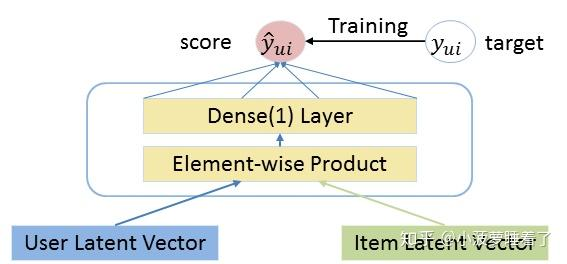 | 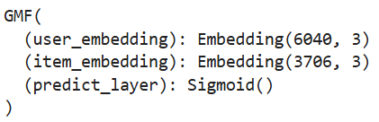 |
| 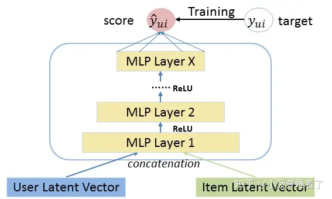 | 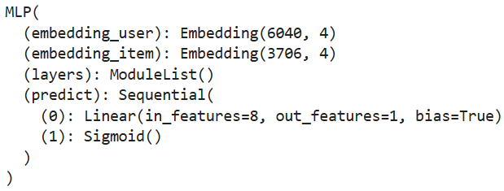 |
| 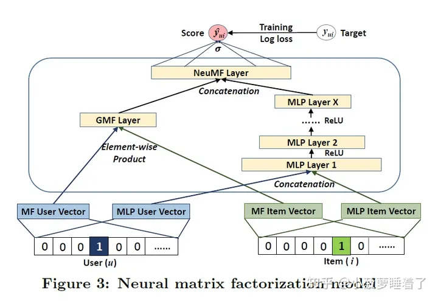 | 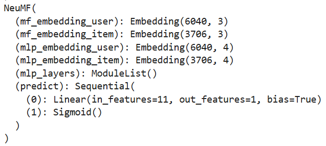 |

### Parameters

| Parameter            | Set                  |
| -------------------- | -------------------- |
| **num of negatives** | 4                    |
| **learner**          | Adam                 |
| **learning rate**    | 0.001                |
| **loss function**    | binary cross entropy |
| **batch size**       | 2048                 |
| **mlp layer**        | 3                    |
| **epoch**            | 50                   |
| **factor number**    | 8                    |

### Evaluate

| Name                                        | Function                                                     |
| ------------------------------------------- | ------------------------------------------------------------ |
| HR(Hits Ratio)                              | $\mathrm{HR}=\frac1{\mathrm{N}}\sum_{\mathrm{i}=1}^{\mathrm{N}}\mathrm{hits}(\mathrm{i})$ |
| NDCG(Normalized Discounted Cumulative Gain) | $\mathrm{NDCG}=\frac{1}{\mathrm{N}}\sum_{{\mathrm{i}=1}}^{{\mathrm{N}}}\frac{1}{\log_{2}\left(\mathrm{p_{i}}+1\right)}$ |

### Experiments

I will point out different parameters comparing with the list above.

#### Model Compare

| Training Loss                                                | HR@10                                                        | NDCG@10                                                      |
| ------------------------------------------------------------ | ------------------------------------------------------------ | ------------------------------------------------------------ |
| 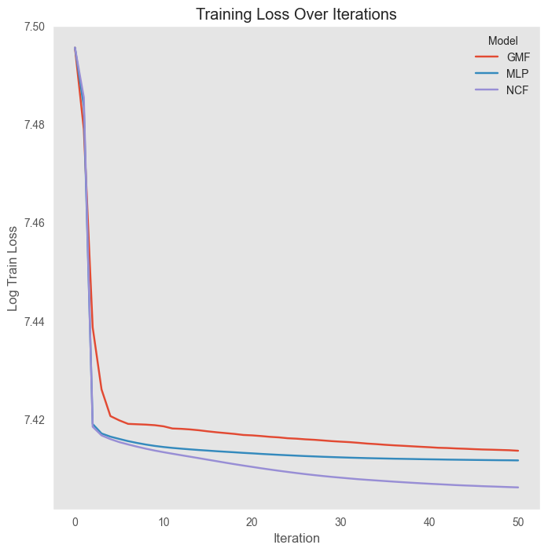 | 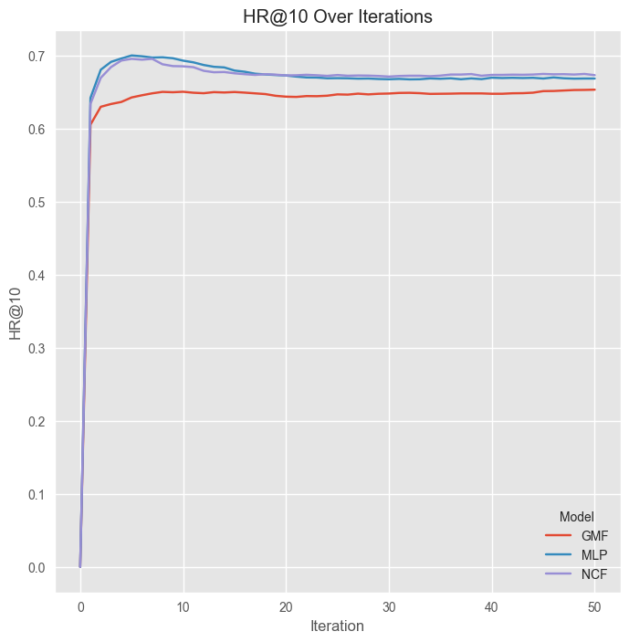 | 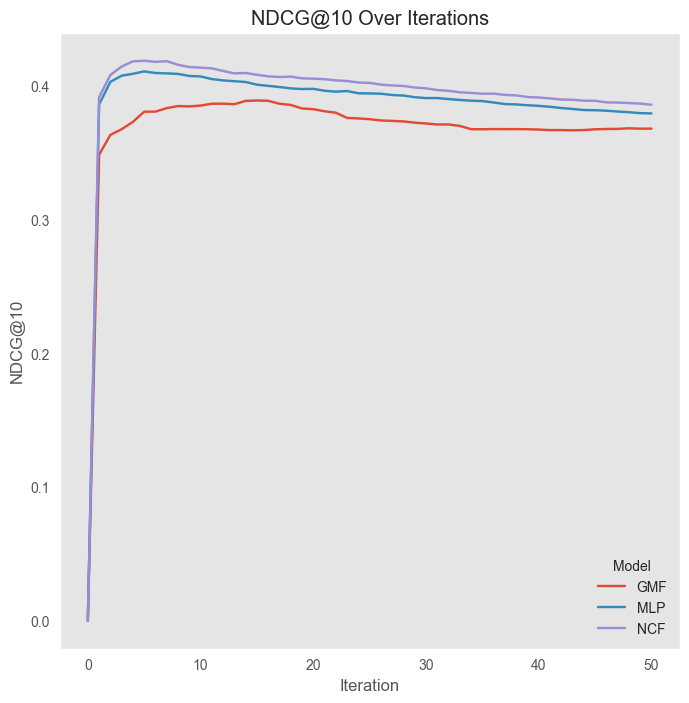 |

#### Ablation study for the MLP layer

For this part, I use **epoch** of 5, **mlp layer** from 0 to 4.

| Training Loss                                                | HR@10                                                        | NDCG@10                                                      |
| ------------------------------------------------------------ | ------------------------------------------------------------ | ------------------------------------------------------------ |
| 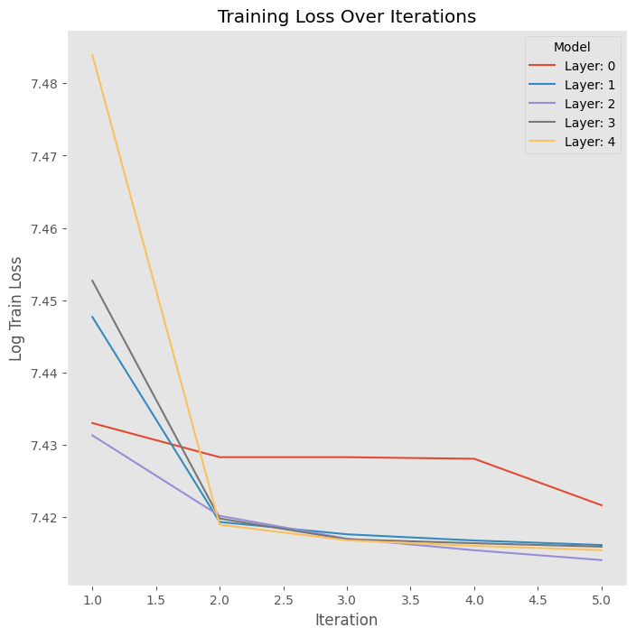 | 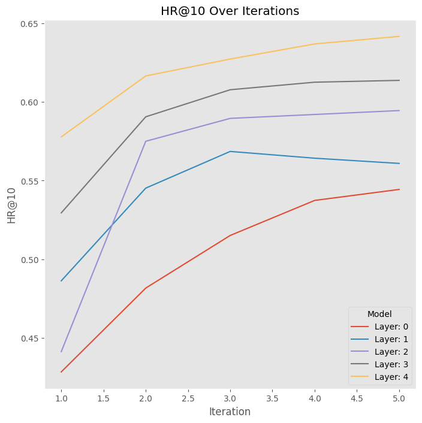 | 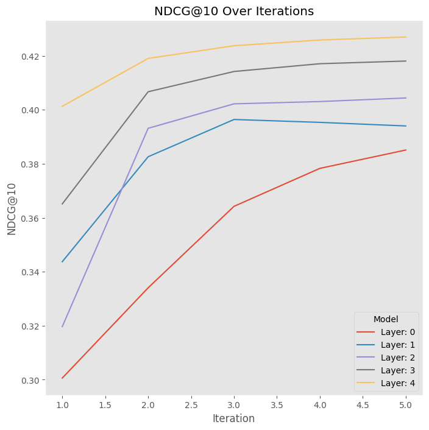 |

| Evaluate    | MLP-0 | MLP-1 | MLP-2 | MLP-3 | MLP-4     |
| ----------- | ----- | ----- | ----- | ----- | --------- |
| **HR@10**   | 0.544 | 0.561 | 0.595 | 0.614 | **0.642** |
| **NDCG@10** | 0.385 | 0.394 | 0.404 | 0.418 | **0.427** |

#### Ablation study for different topK

For this part, I use **epoch** of 5, **topK** from 1 to 10.

| Training Loss                                                | HR@10                                                        | NDCG@10                                                      |
| ------------------------------------------------------------ | ------------------------------------------------------------ | ------------------------------------------------------------ |
| 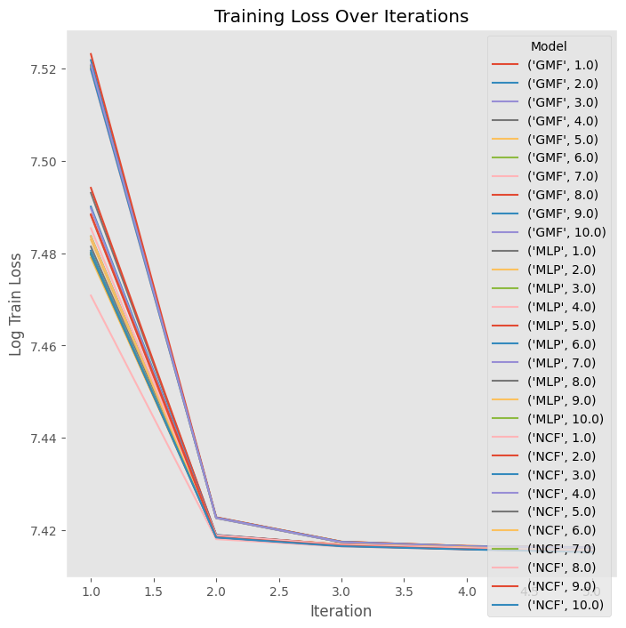 | 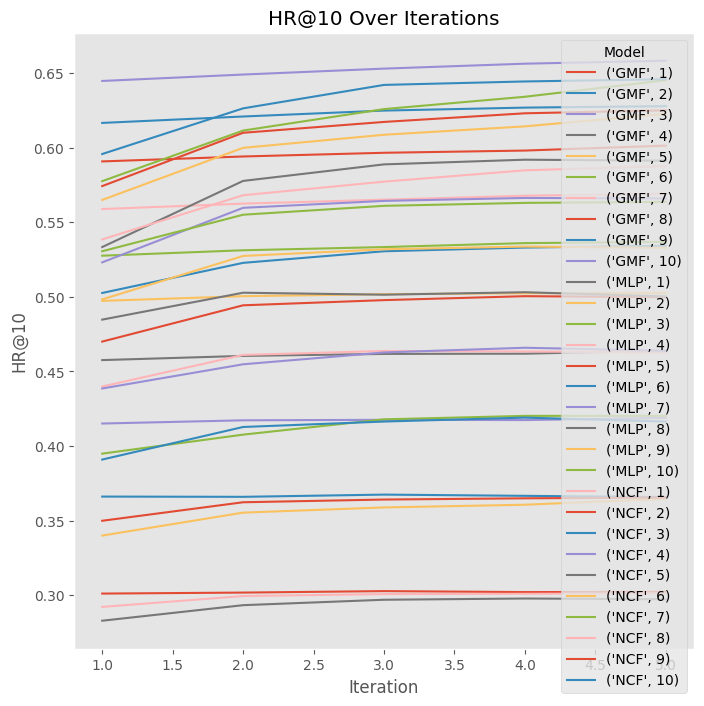 | 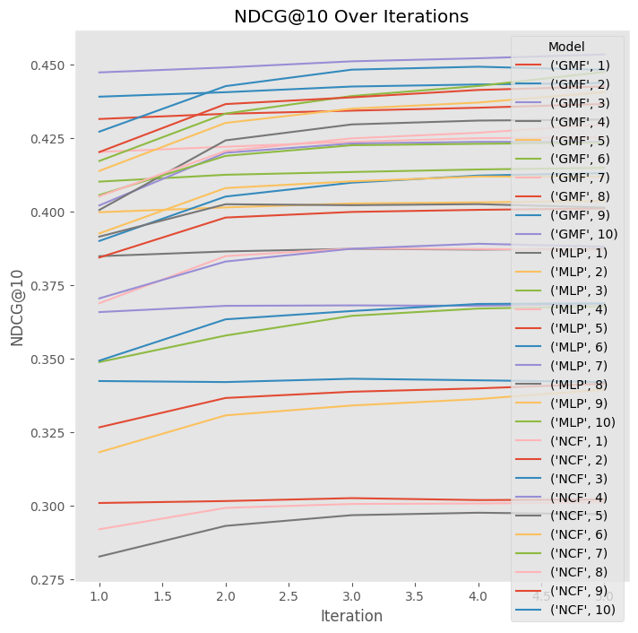 |

| HR                                                           | NDCG                                                         |
| ------------------------------------------------------------ | ------------------------------------------------------------ |
| 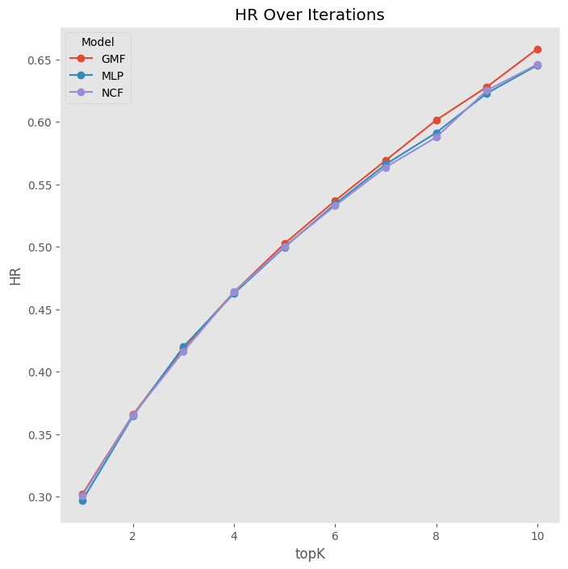 | 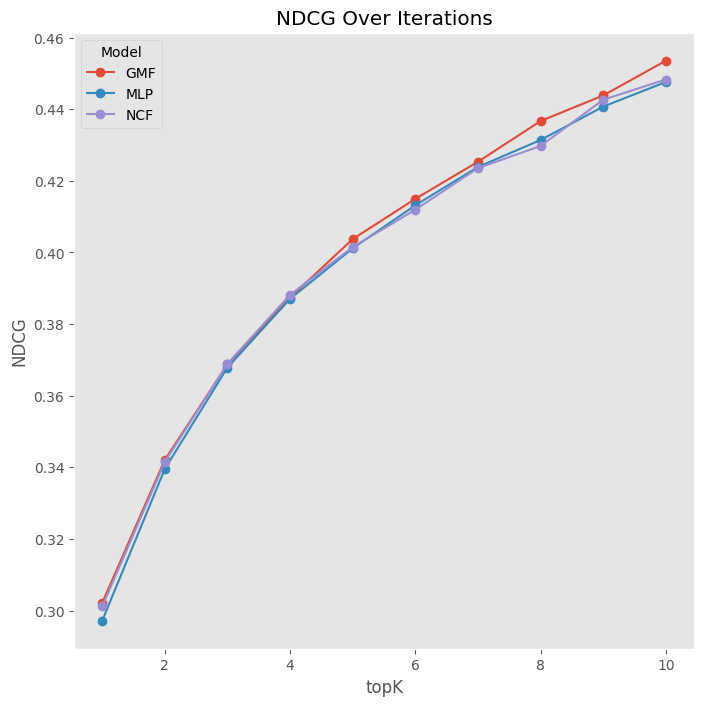 |

#### Ablation study for different factor

For this part, I use **epoch** of 5, **factor number** of 8, 16, 32, 64.

| Training Loss                                                | HR@10                                                        | NDCG@10                                                      |
| ------------------------------------------------------------ | ------------------------------------------------------------ | ------------------------------------------------------------ |
| 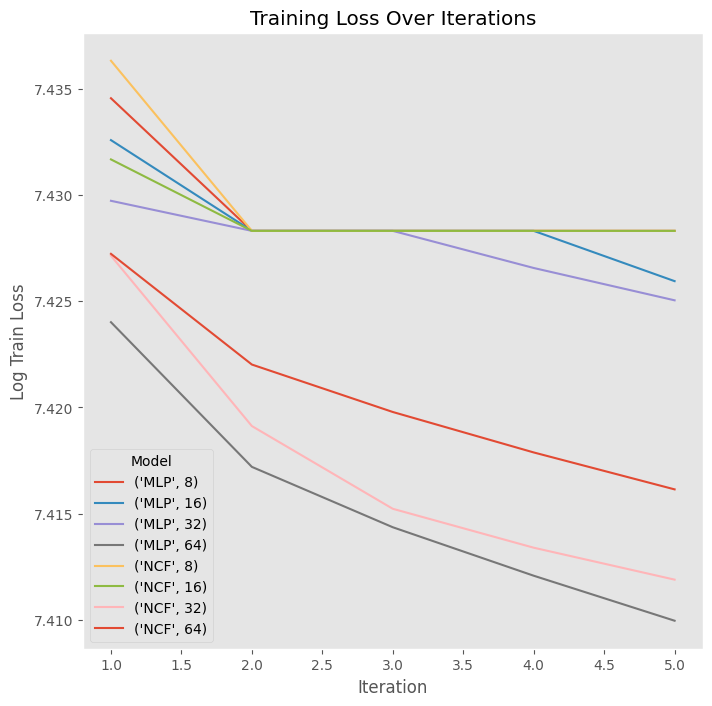 | 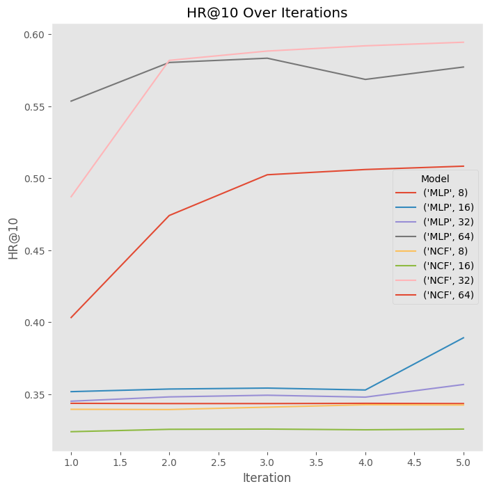 | 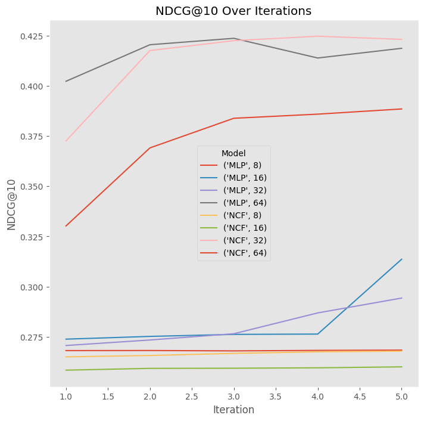 |

| HR@10                                                        | NDCG@10                                                      |
| ------------------------------------------------------------ | ------------------------------------------------------------ |
|  | 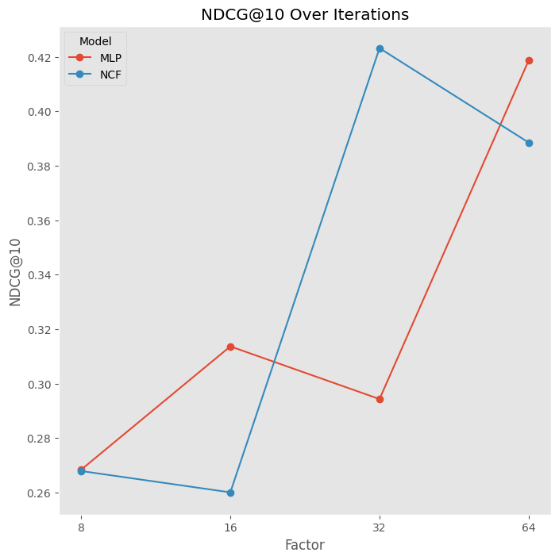 |

